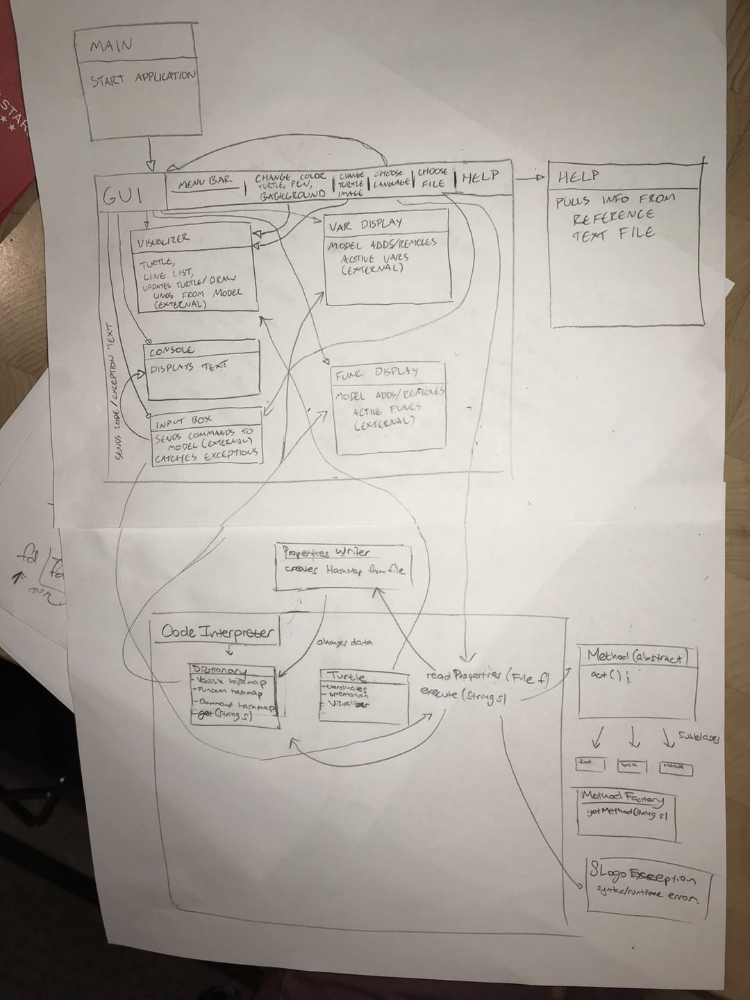

DESIGN_PLAN.md
===
# Introduction
This implementation of SLogo is intended to be an IDE that properly interprets and displays the results of input code written in SLogo. The program consists of a View, which handles the user interface and the graphical display, and the Model, which translates input code into actions on the Turtle or the surroundings. The View will call the Model when the user inputs code or selects a file to run; the Model will call the View either after a command is successfully run (to update the display).

The project should be open to adding more commands and more languages; the basic Read/Execute/Return structure of SLogo and the basic user interface should be closed to modification.

# Design Overview
The project is split into two distinctive parts: View and Model. 
* View's role is to interact with the user, receive inputs, receive files and display the result on the screen,
* Model's role is to interpret commands, play them out, and tell the View what to display on the screen.

The  View will use the external API of the Model to execute commands.

The Model will use the external API of the View to update the turtle, draw lines, and display the active user-defined fuctions and variables.


## View
### Internal API
Internally, View would have Main, MenuBar, VariableDisplay, FunctionDisplay, InputBox, GUI, Help, Console, and Visualizer classes.
* Main: Main would be the class to start the application, doing little more than instantiating GUI and displaying it.
* GUI: GUI would instantiate each of the other View classes, and place them appropriately. It will also control the language of the UI.
* MenuBar: This menu would contain buttons or drop-down sub menus. These buttons include changing the colors of various visualizer objects, changing the image of the turtle, change language, choose file, and a help button.
* InputBox: InputBox, where the user types commands, would pass these commands to the Model, as well as the Console. It would catch any exceptions from the Model, and pass these exceptions to the Console as well. If a text file is opened by the user, it's contents as a String will be passed to this class, which will pass it along to model.
* Console: Console would receive text information from the InputBox to display. It would display each command and its exception, if one exists.
* VariableDisplay: This display, updated from Model, would have no other internal connections within View.
* FunctionDisplay: This display, updated from Model, would have no other internal connections within View.
* Visualizer: This would contain the "Turtle," and ImageView object, at a location determined by Model (initially in the center, (0,0)). It would also contain a list of lines drawn, that would appear as JavaFX line objects. It would also have methods to change background color, turtle color, and line color. Additionally, it will have a changeTurtleImage(Image) method that would change the turtle's image.
* Help: When the user selects the help button, this class will be initialized, which will create a new window that reads information from a command reference file. 

### External API
Model will interact with View through the Visualizer, VariableDisplay, and FunctionDisplay. 
* For Visualizer, the Model would use moveTurtle(x, y), rotateTurtle(angle), and drawLine(x1, y1, x2, y2), which would set the new location and orientation of the turtle, and draw lines if the pen is down. It would have a reset() method that clears all lines and resets the turtle position.
* For VariableDisplay, the Model would use addVariable(var) and removeVariable(var) to add and remove active variables in the user's code. 
* For FunctionDisplay, Model would use addFunction(func) and removeFunction(func) to add and remove user-defined functions.

## Model
### Internal API
Internally, Model will have Turtle, Dictionary, PropertiesReader, and the Method/subclasses
* Turtle: The turtle stores an orientation, coordinates, and an instance of the Visualizer. Calls to the Turtle will be made by the method sub classes.
* The Dictionary holds maps of input strings to commands, methods and variables. It is used by the code interpreter through get methods.
* Method subclasses will be created and called by the CodeInterpreter.
* An instance of PropertiesReader will be held in the CodeInterpreter. It makes a new instance of Dictionary from a given file, and is used when changing the language.

### External API
View will the interact with Model through the CodeInterpreter class and the SLogoException class.
* For CodeInterpreter: the View will call execute(String) 
* An SLogoException will be thrown when there is an error found in the String passed in.


# User Interface

* Visualizer: turtle and the lines will be displayed here
* Textbox where the user can type in commands
* Variable display box
* Function display box
* Console: contains history and results of running the code, including error reporting
    * These errors include syntax errors, arithmetic errors, and I/O Exceptions for opening and reading files
* Menu bar: 
    * Open file: the user can open a file containing code
    *  Set image: what turtle image to use (brower file to import)
    *  Set pen color (drop down for color selection)
    *  Set background color (drop down for color selection)
    *  Help: Pops up window, reads from a reference text file

# API Details
* The APIs can be found in the /src folder for the project, on the master branch.

## View
### External
* The external API for View revolves around updating the GUI with new information from Model. Model is able to update the position and orientation of the Turtle image, as well as add lines, with public methods available in the Visualizer method. This Visualizer class will house the turtle image and any lines drawn, so the user can see the direct results of their code. Any new actions or movements by the turtle should be able to be simplified to these basic commands, so it is extendable in that respect.
* VariableDisplay and FunctionDisplay are the other external connections from View to Model. They both offer add and remove methods to add active variables and functions defined by the user, so that they can be displayed for the user. 

### Internal
* The Main class serves as the main file for the application, and serves to launch the application. It instantiates the GUI class and launches the application, but not much else. 
* The Gui class instantiates each GUI element and places them appropriately. Using this class, it is easy to rearrange elements, and add new ones. This class will also set the language for the other elements in the GUI, as it has access to all of them. It will open a language properties file and reassign the labels for each element. It may throw a FileNotFoundException if that language file is not found, which will be caught and the user will be notified with a pop-up. Its internal API only includes a method for setting the language, with an argument for the relevant language file. New languages can be added by simply adding a new resource file, and a new option in the menu. This method will be called by a change language button in the menu bar.
* The variable and function displays have no internal API to be used by other view classes. They will be instantiated and placed by the GUI, but they have no other interactions. This is because these classes are purely reactionary to what happens in the Model, so they are effectively separated from the rest of the View classes. They are extendable to new variable types and function types, as Model will process those new types, and give these displays a String to display.
* The Help class will have an internal API consisting of a launch command, which triggers it to create a new window based on a help resource file. This command will come from the help button from the menu bar. This method may throw a FileNotFoundException if that help file is not found, which will be caught and the user will be notified with a pop-up. New methods and functionality can be added to the help page by altering the help resource file.
* The Visualizer class will be used to create a Visualizer object which is where the turtle is displayed and where the lines are drawn. <br/> The Visualizer class's internal API includes changePenColor(Color color), changeTurtleImage(ImageView image), and changeBGColor(Color color) which will be called by the MenuBar class to change the instance variables penColor, bgColor, and turtleImage of the Visualizer.
* The MenuBar class's internal API contains the following: changeLanguage(File file) which changes the language displayed of the menu bar based on the file input and openCodeFile() which opens a file containing code and passes code to InputBox class.
* The TextBox class's internal API contains the following: setLocation(int x, int y) which sets the location of the input box and processText(String s) which passes commands to the Model and console.
* The console class's internal API contains the followling: setLocation(int x, int y) which sets the location of the console; clear() which clears all the text displayed in console; and displayText(String s) which displays the text s in the console

## Model
### External
* The external API for Model implements the general logic for changing the code language and for parsing commands. It relies on the Turtle, Methods, Dictionary, and PropertiesReader and calls instances of those classes to execute specific logic associated with its two main tasks. It is deliberately small and is mostly closed to modification; the general flow of SLogo parsing logic, as well as the general flow of property-reading logic are found in the External API; a change to the external API might be implemented only if a programmer wants to make significant changes to how SLogo is interpreted.
* The CodeInterpreter class is the hub of the Model package; it uses information from the Dictionary to correctly execute SLogo passed into it. It is a necessary inclusion because it allows the View to call the Model based on user input. By having most of the external API exist as general implementations found in the CodeInterpreter, the program is better shielded from unwarranted modifications and is thus more secure.
* The SLogoException is an exception thrown by the interpreter when a compile or runtime error occurs. The SLogoException is meant to be passed to the view, where its message can be displayed to the user so that they can fixed their code. The exception allows for the program to recognize and throw new errors associated with SLogo interpretation

### Internal
* The Turtle class is not only responsible for keeping track of and updating the Turtle, but also updates the graphical display of the cell by calling methods on the Visualizer it posesses. It is integral to the design because it allows the graphical display to be updated only in situations where the turtle moves (as opposed to the evaluation of a mathematical expression and loop) and ties the Model back to the View. The Turtle is more than just a storage box for Turtle data; it updates is position on the display and calls the creation of any lines that need to be drawn.
* The PropertiesReader is responsible for reading the lanugage properties associated with a file. Having the parsing logic of properties files be sequestered to its own class is consistent with the coding principle of decomposition; the class itself is a simple helper class that builds the Map of possible inputs to commands based on the file. Other implementations of this reader might read files with a different format. Note that if a properties file does not contain an associate an input string to a command, the command is inaccessible; thus, limiting the commands that can be run can be implemented by just removing mention of those commands from the properties files.
* The Dictionary keeps track of all variables, functions, and commands. It is updated by the CodeInterpreter when the language is changed and when new variables/functions are created, and is responsible for linking input strings to the appropriate variable, function, or command. It allows for modularization in case future impelemntations require different variables to be stored (e.g. String variables or array variables); this way, the Dictionary can be updated without having major effects on the other parts of the Model.
* The Method abstract class is a method with a single method, act() that its subclasses implement to cause certain commands. The reason for this method of design is that while it is more complicated to implement than just having a switch/case statement in the CodeInterpreter, it allows for others to add new commands easily (a form of extension) without allowing them access to the CodeInterpreter's inner workings. Various subclasses might call the Turtle to move or evaluate the result of an expression. The Method is called by the CodeInterpreter; certain subclasses might depend on the Turtle.
* The MethodFactory is a way to create specific instances of Method; this follows the Factory design pattern and shields the instantiation logic from the user. Any new commands will simply have to add a new option to the MethodFactory.

# API Example Code
* The user types 'fd 50' in the command window, and sees the turtle move in the display window leaving a trail, and the command is added to the environment's history. <br/>The View: 

```java
    //inside GUI class
    Visualizer vi = new Visualizer();
    CodeInterpreter ci = new CodeInterpreter(vi);
    ...
    //inside InputBox class
    TextField input = new TextField();
    ...
    try{
        String inputString = input.getText();
        ci.execute(inputString);
    }
    catch(SLogoException e) {
        displayException(e.getMessage());
    }
```

The Model:
In CodeInterpreter class:

```java
    public void execute(String s) {
        String methodname = myDictionary.getMethodName(s);
        Method m = myMethodFactory.getMethod(methodname);
        m.act();
    }

```
## Use Cases
### On the menu bar, the user changes the language from English to French. 
* This causes a method in the View internal API to run, which calls the CodeInterpreter method readProperties() for the properties file associated with that Language. The call to readProperties prompts the CodeInterpreter to create a new PropertiesReader with the given file; the PropertiesReader parses a HashMap of strings to commands from the file. The CodeInterpreter then updates the Dictionary command HashMap to match the newly created one. The View internal API method also calls other internal methods to set all button text to the appropriate language.
    * Example code:
In the Model:

```java
    public void readProperties(File f) {
        PropertiesReader mapCreator = new PropertiesReader(f);
        // PropertiesReader reads the file and creates map of commands
        myDictionary.setLanguage(mapCreator.getMap());
    }
```
In the View:

```java
    public void changeLanguage() {
        File f = getPropertiesFile();
        CodeInterpreter.readProperties(f);
        updateButtons();
    }
```

### The user wants to type in "fd 50" but types in "df 50" instead and hits enter. "df" is not a user-defined variable or function.
```java
    //inside GUI class
    Visualizer vi = new Visualizer();
    CodeInterpreter ci = new CodeInterpreter(vi);
    ...
    //inside InputBox class
    try{
        TextField input = new TextField();
        String inputString = input.getText();
        ci.execute(inputString);
    }
    catch(SLogoException e) {
        displayException(e.getMessage());
    }
```
The code is the same as before, but the ci.execute(inputString) now returns an SLogoException as 'df' is not a valid command. The Exception is displayed to the user as an alert and is printed to the console.

### User wishes to input a variable x = 50

The user types x = 50 and hits enter into the textInput.

```java
    //inside GUI class
    Visualizer vi = new Visualizer();
    CodeInterpreter ci = new CodeInterpreter(vi);
    Cosole c;
    ...
    //inside InputBox class
    TextField input = new TextField();
    try{
        String inputString = input.getText();
        ci.execute(inputString);
        c.displayText(inputString);
    }
    catch(SLogoException e) {
        c.displayText(e.getMessage());
    }
```

The execute method of the CodeInterpreter is called. CodeInterpreter uses the addFunction method of the Dictionary:
```
void addFunction(String key, String value);
```

### User wants to clear screen

He types in the clear command to the input.

The execute method of the CodeInterpreter is called with param "clear".
```
ci.execute("clear");
```

The Dictionary getCommand method is called by the CodeInterpreter, which makes a new instance of subclass Clear, and calls the 'act' method.

```
dic.getCommand("clear");
```


The act method sets the turtle positions to 0,0 and sets the rotation back to default.

```
turtle.moveTo(0,0);
turtle.rotate(0);
```

The act method then calls the reset method of the visualiser

```
vi.reset();
```

### User wants to change the color of the pen

The user clicks the color picker for pen color on the menu bar. Because of the code below in MenuBar class, 
```java
    private void setUpPenColor() {
        ColorPicker colorPicker = new ColorPicker();
        colorPicker.setValue(Visualizer.DEFAULTPENCOLOR);
        
        Text text = new Text(PEN);
        
        colorPicker.setOnAction(new EventHandler() {
            public void handle(Event t) {
                ci.setPenColor(colorPicker.getValue());               
            }
        });
        
        grid.add(text, 0, 0);
        grid.add(colorPicker, 1, 0);
    }
```
the penColor instance variable of the ci object is changed with the setter below in Visualizer class.. 
```java
    protected void setPenColor(Color color) {
        penColor = color;
    }
```
Next time the user draws something with the turtle, it will be drawn with a different color.
### User wants to change the color of the background

The user clicks the color picker for background color on the menu bar. Because of the code below in MenuBar class, 
```java
    private void setUpBGColor() {
        ColorPicker colorPicker = new ColorPicker();
        colorPicker.setValue(Visualizer.DEFAULTBGCOLOR);
        
        Text text = new Text(BG);
        
        colorPicker.setOnAction(new EventHandler() {
            public void handle(Event t) {
                ci.setBGColor(colorPicker.getValue());               
            }
        });
        
        grid.add(text, 2, 0);
        grid.add(colorPicker, 3, 0);
    }
```
the BGColor instance variable of the ci object is changed with the setter below in Visualizer class. 
```java
    protected void setBGColor(Color color) {
        bgColor = color;
    }
```
The background color is changed in the next step in main.

### User wants to open a text file, and run the commands specified in that file.
* The file would first be choosen with a FileChooser and converted to one large String within the open file button class. 

```java 
    // Within event handler
    File toBeRead;
    TextBox tb;
    ...
    String fileText = new Scanner(toBeRead).useDelimiter("\\A").next();
    tb.processText(fileText);
```
* Within the TextBox, that file text will be processed as usual.

```java 
    //inside InputBox class
    CodeInterpreter ci;
    Console c;
    ...
    try{
        ci.execute(inputString);
        c.displayText(inputString);
    }
    catch(SLogoException e) {
        c.displayText(e.getMessage);
    }
```
* The interpreter will process and execute the commands as it would with command line entries.

### The User opens the Help window
* The event handler for the help button would trigger first.

```java 
    // Within the help button event handler
    Help h;
    ...
    try {
        h.launch();
    } catch (FileNotFoundException e) {
        displayErrorPopup(e.getMessage());
    }
```

* Within Help, it would then read the file, and potentially throw a FileNotFoundException. Assuming no exception, a new window would display with the help text.

# Design Considerations
* One design consideration that was debated was how the View would get information from the model regarding the Turtle. 
* We heavily debated how to implement all the commands. We knew that we would have a dictionary that held all the typed commands and mapped to to something. However, this would be difficult because the value of what it's mapped to is a 'method' of sorts. This lead us to deciding we want a method superclass, with subclasses having one method called 'act'. Then this raised the issue of how parameters would be added if the 'act' method doesn't take parameters. We decided the subclasses constructors would take the parameters and initialise instance variables, and the 'act' method would work with these instance variables
* We debated whether the Model or View should handle a code file chosen by the user. Ultimately, it was decided to simplify the Model's external API by having the View convert the file contents to a String, and pass that to View through the CodeInterpreter execute method. This would have the added benefit of being easy to print to the console in text form.
* We discussed where objects would be constructed and held, and which Clases will its methods be called from. E.g. the Properties Reader would be in the CodeInterpreter and would be called from the code interpreter to update the dictionary.

# Team Responsibilities
Note that the secondary responsibility for all teammembers is the portion of their assigned section that is not already their primary responsibility.
* Jack Fitzpatrick: View
    * Main
    * Gui
    * Variable Display
    * Function Display
    * Help
* Eddie Yang: View
    * Menu Bar
    * Visualizer
    * Console
    * InputBox
* Jeffrey Li: Model
    * Methods
    * MethodFactory
    * PropertiesReader
    * Turtle
* Andrew Yeung: Model
    * CodeInterpreter
    * Dictionary
    * SLogoException